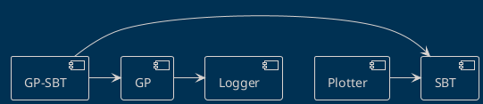

Software Guidebook
==================

## Introduction

## API

### BehaviorTreeExecutor

### BehaviorTreeLearner

## Internals
### Dependencies

```plantuml
@startuml

!theme blueprint
[GP-SBT] -> [GP]
[GP] -> [Logger]
[GP-SBT] -> [SBT]
[Plotter] -> [SBT]

@enduml
```